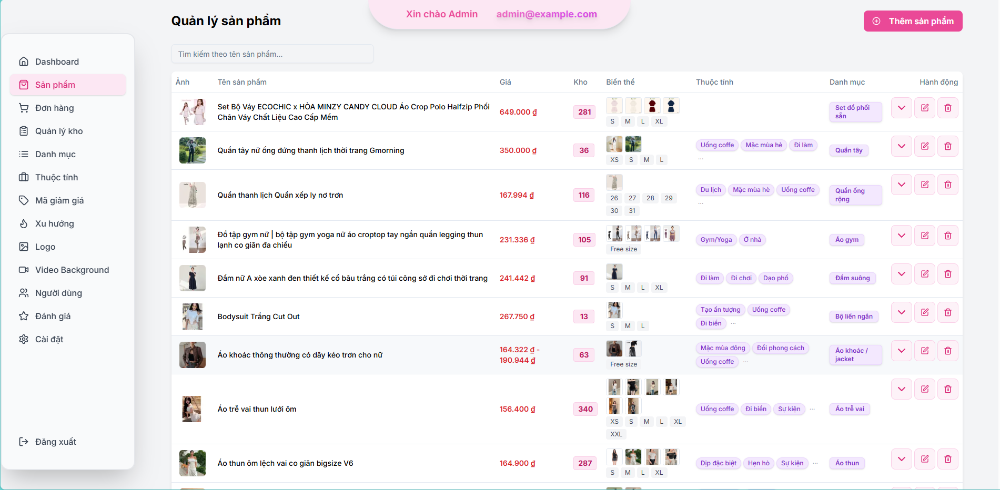

# Ecommerce Website - Fullstack Clothing Store

<p align="center">
  
  
  
  
  
  
  
  
  
  
</p>

Demo: [https://doovin.vercel.app/](https://doovin.vercel.app/)

---

## 📖 Introduction
A modern, full-featured ecommerce website for clothing stores, built with Next.js, Prisma, PostgreSQL, and TailwindCSS. The platform supports user registration, login, product search, cart, checkout, wishlist, product reviews, and a powerful admin dashboard for store management. Products support multiple variants (color, size, price, image), attributes for use cases/occasion wear (e.g. Party, Work, Sport), and discount codes (promotions). Admins can manage all aspects of the store, including products, orders, users, promotions, and analytics.

---

## 💻 Features

### User
- Register / Login / Logout (NextAuth)
- Browse product categories
- Add products to cart
- Checkout and order management
- Filter and search products
- Wishlist (save favorite products)
- Product reviews
- Manage addresses and payment methods
- **View and filter products by use cases / occasion wear (e.g. Party, Work, Sport, etc.)**
- **View and select product variants (color, size, price, image)**
- **Apply discount codes (promotions) at checkout**

### Admin
- Product management (Add, Edit, Delete)
  - Manage product variants (color, size, price, image)
  - Assign use cases / occasion wear attributes to products
- Order management
- User management
- Category, color, size, attribute management
- Promotions & voucher management (create, edit, disable discount codes)
- Trends management
- Review management
- Dashboard with statistics (revenue, orders, users, top products)
- System settings
- Admin access restricted to desktop/tablet

---

## 🏗️ Tech Stack
- **Frontend:** ReactJS (Next.js 14), TailwindCSS, Framer Motion, Radix UI
- **Backend:** Node.js (Next.js API routes), Prisma ORM
- **Database:** PostgreSQL (Dockerized)
- **Authentication:** NextAuth (JWT, Google, Email)
- **Image Storage:** Cloudinary
- **Analytics:** PostHog
- **Deployment:** Vercel, Docker

---

## 🖼️ Screenshots
> _Note: Add your real UI screenshots for Home, Product, Admin pages in the `public/screenshots/` folder and reference them below._

Example:




---

## 🚀 Getting Started

### 1. Clone the repository
```bash
git clone https://github.com/phuc246/ecommerce-website.git
cd ecommerce-website
npm install
```

### 2. Start the database (PostgreSQL)
```bash
docker-compose up -d
```

### 3. Configure environment variables
Create a `.env` file and fill in the required variables (see `.env.example` if available).

### 4. Initialize the database
```bash
npx prisma migrate dev --name init
npx prisma db seed
```

### 5. Run the development server
```bash
npm run dev
```
Visit [http://localhost:3000](http://localhost:3000)

---

## 🗄️ Folder Structure
```
ecommerce-website/
├── src/
│   ├── app/           # Routing, pages, API routes, layouts
│   ├── components/    # UI components (admin, user, home, forms, ...)
│   ├── hooks/         # Custom React hooks
│   ├── lib/           # Auth, prisma, utils, validation
│   ├── types/         # TypeScript types, interfaces
├── prisma/            # Prisma schema, migrations, seed
├── public/            # Static assets, images, icons, video, logo
```

---

## 🧩 Main Libraries Used
- ReactJS, Next.js
- TailwindCSS, Radix UI, DaisyUI
- Prisma ORM
- NextAuth
- Cloudinary
- Framer Motion
- SWR
- Zod
- PostHog (analytics)
- Nivo, Recharts (charts)
- JSPDF, xlsx (export PDF, Excel)

---

## ✅ Roadmap
- [x] Complete product CRUD (create, read, update, delete)
- [x] Product variants (color, size, price, image)
- [x] Product attributes: Use Cases / Occasion Wear
- [x] Wishlist (save favorite products)
- [x] Promotions & discount codes (voucher)
- [x] User authentication & profile management
- [x] Cart & checkout flow
- [x] Product reviews & ratings
- [x] Admin dashboard & statistics
- [x] Order management
- [x] Category, color, size, attribute management
- [x] Trends management
- [x] Responsive UI (desktop, tablet, mobile)
- [x] Admin access control (desktop/tablet only)
- [x] Analytics & user behavior tracking (PostHog)
- [x] Export reports (PDF, Excel)
- [ ] Stripe payment integration (coming soon)
- [ ] Advanced analytics & reporting
- [ ] More payment methods
- [ ] Multi-language support
- [ ] More UI/UX enhancements
- [ ] Performance optimization

---

## 📄 License
MIT License.

---

**Enjoy your shopping experience! 🚀** 
